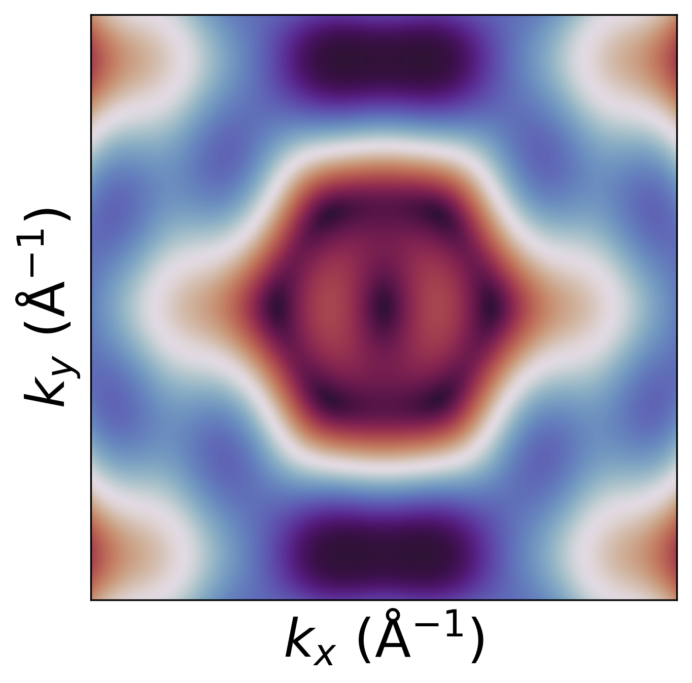
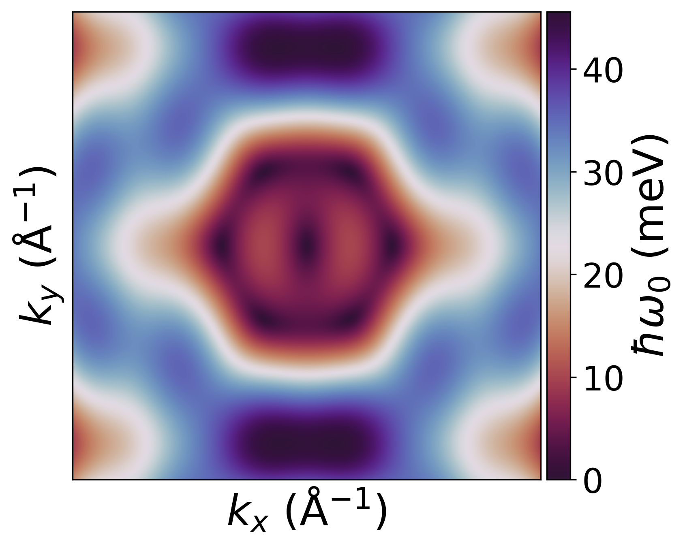
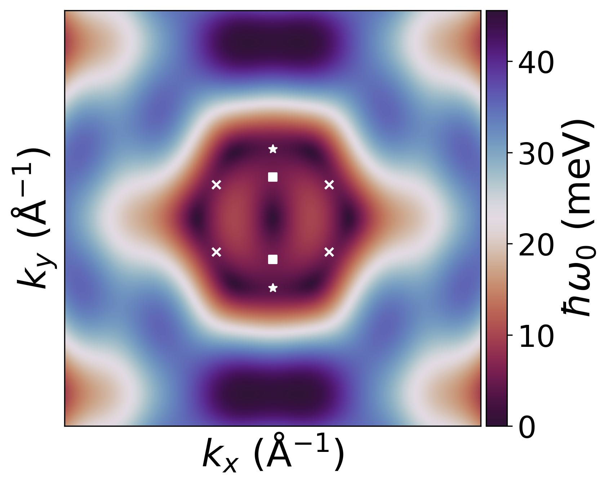

.. _exercises_matplotlib_imshow:

Imshow 1
========

* Load the data from the :download:`file <dispersion.txt>`

* Reshape the data into the 2D matrix

* Plot Energy vs kx, ky as a imshow plot.

* Make the plot square (google ax.set_aspect())

* Add labels to both axis

* Remove ticks from both axis

* Save the figure

.. dropdown:: Answer

  .. literalinclude:: imshow-1.py
    :language: python

Imshow 2
========

* Add colorbar to the plot from previous exercise.

* Add label to the colorbar.

* Increase size of ticks of the colorbar.

.. dropdown:: Answer

  .. literalinclude:: imshow-2.py
    :language: python

Imshow 3
========

* Add points to the picture. Points coordinates are:

  .. code-block:: python

    POINTS = [
        [(0, 0.36740000), (0, -0.36740000)],
        [
            (0.2974, 0.17840123),
            (-0.2974, 0.17840123),
            (0.2974, -0.17840123),
            (-0.2974, -0.17840123),
        ],
        [(0, 0.21780000), (0, -0.21780000)],
    ]
    MARKERS = ["*", "x", "s"]

.. dropdown:: Answer

  .. literalinclude:: imshow-3.py
    :language: python