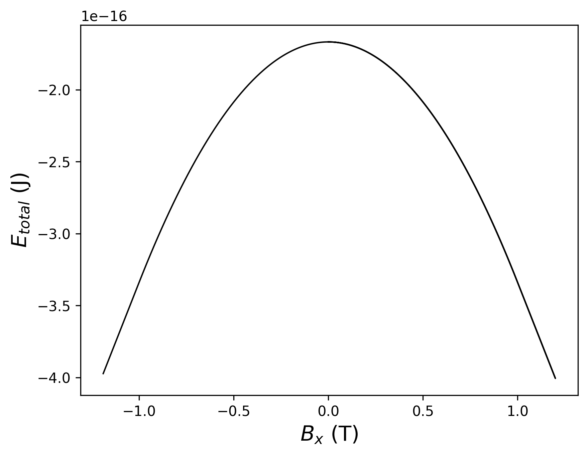
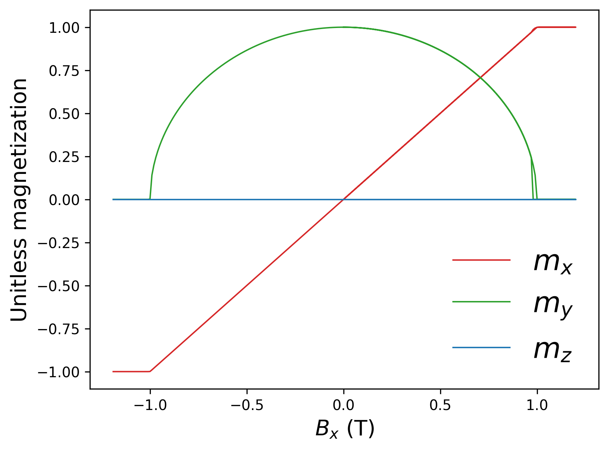
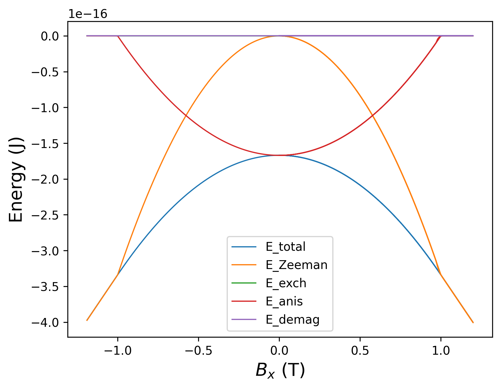

.. _exercises_matplotlib_plot:

Plot 1
==========

* Load the data from the :download:`file <plot-123.txt>`

* Plot Total energy vs x component of the magnetic field

* Add labels to both axis

* Save the figure

.. dropdown:: Answer

  .. literalinclude:: plot-1.py
    :language: python

Plot 2
==========

* Load the data from the :download:`file <plot-123.txt>`

* Plot three components of magnetization vs x component of the magnetic field.
  Set colors for each component.

* Add labels to both axis.

* Add legend to the plot.

* Put legend in the lower right corner. Remove frame of the legend. Increase legend's fontsize.

* Save the figure

.. dropdown:: Answer

  .. literalinclude:: plot-2.py
    :language: python

Plot 3 (extra)
==================

* Load the data from the :download:`file <plot-123.txt>`

* Plot all energies vs x component of the magnetic field. Use **for** loop.

* Add labels to both axis.

* Add legend to the plot.

* Save the figure

.. dropdown:: Answer

  .. literalinclude:: plot-3.py
    :language: python

