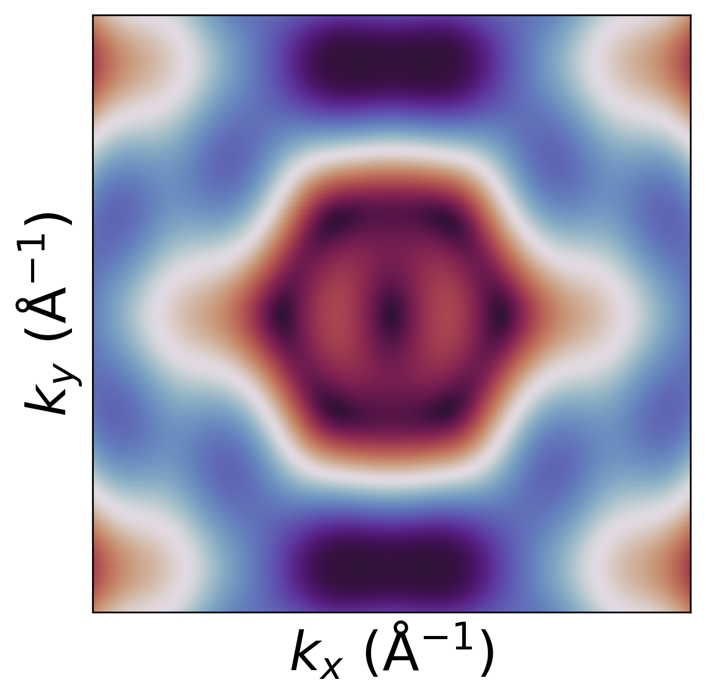
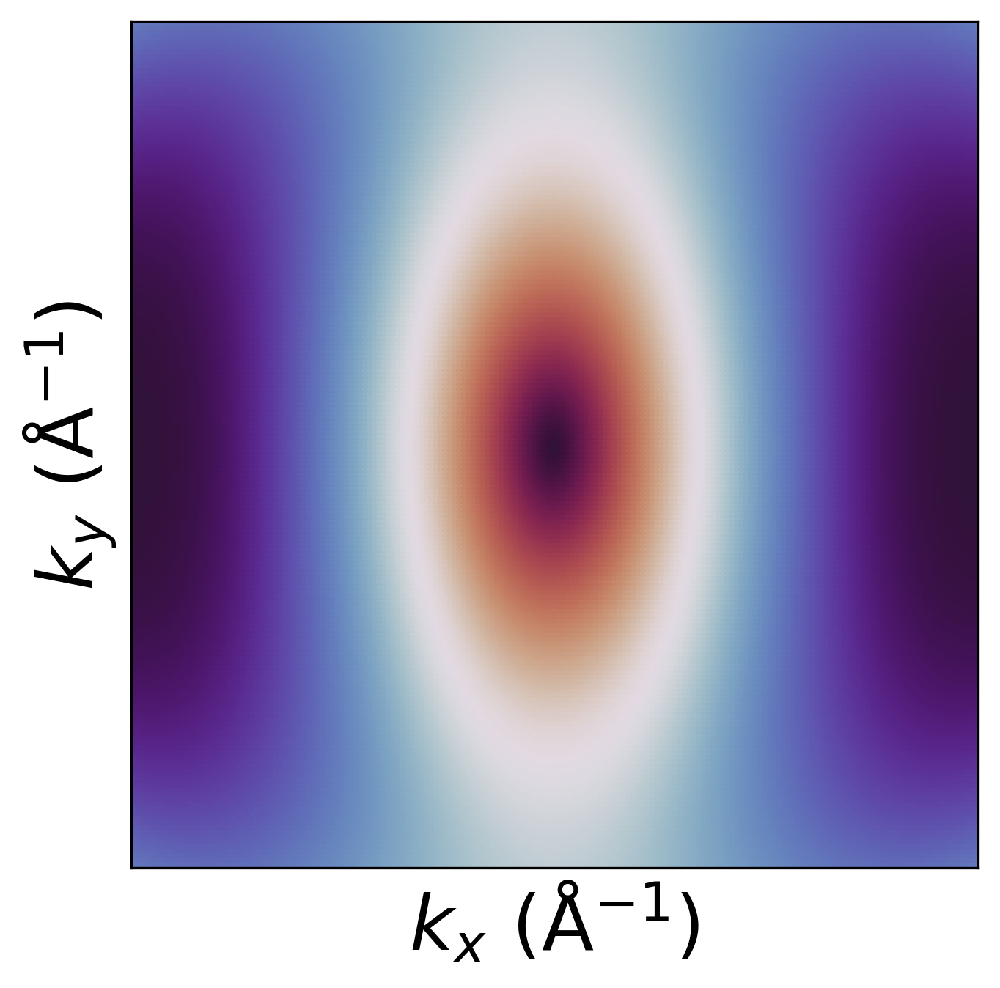

.. _exercises_matplotlib_scatter:

Scatter 1
=========

* Load the data from the :download:`file <dispersion.txt>`

* Plot kx, ky points using Energy as a color (use ``ax.scatter()``).

* Adjust the marker size to obtain the best overall result

* Set linewidth of the marker edge to zero

* Add labels to both axis

* Remove ticks from both axis

* Set appropriate limits for both axis.

* Save the figure

.. dropdown:: Answer

  .. literalinclude:: scatter-1.py
    :language: python

Scatter 2 (extra)
=================

* Load the data from the :download:`file <dispersion.txt>`

* Do the same as in the previous exercise, but filter the data with the condition
  :math:`-0.2 < k_x < 0.2>` and :math:`-0.2 < k_y < 0.2`.

.. dropdown:: Answer

  .. literalinclude:: scatter-2.py
    :language: python