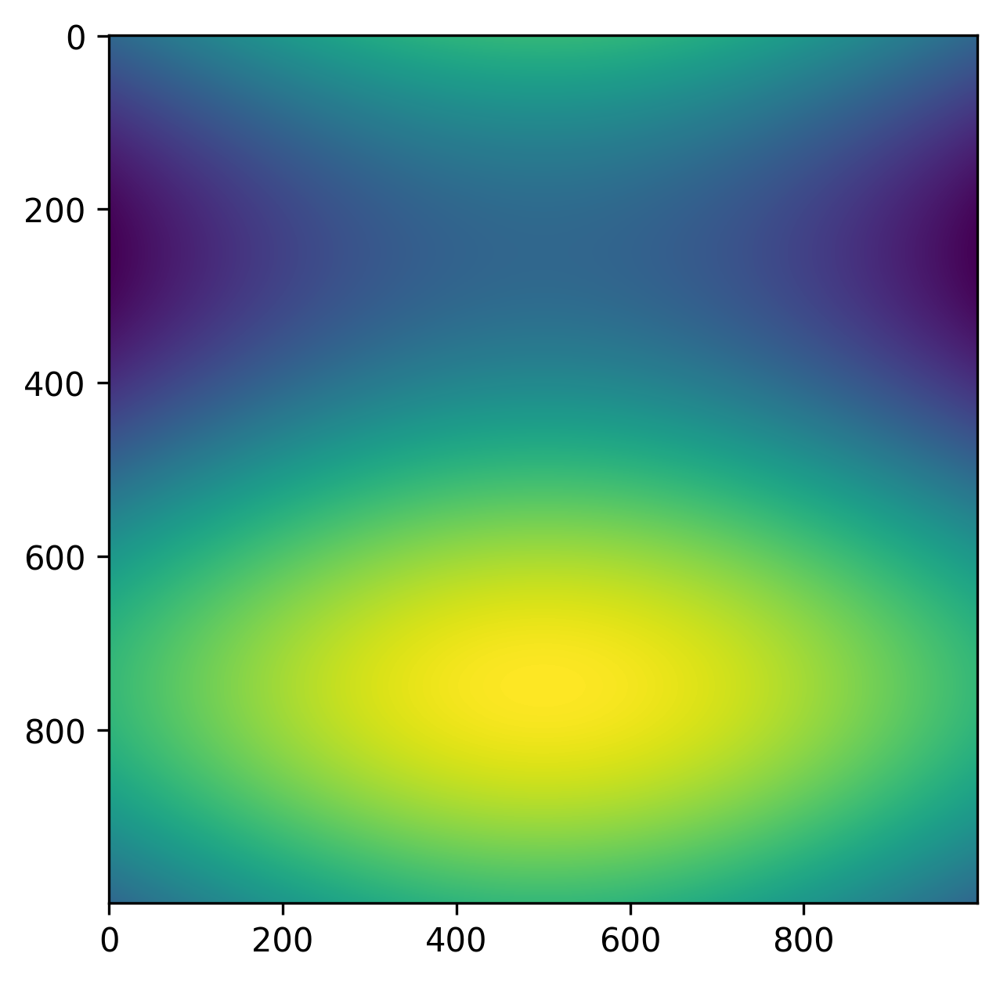
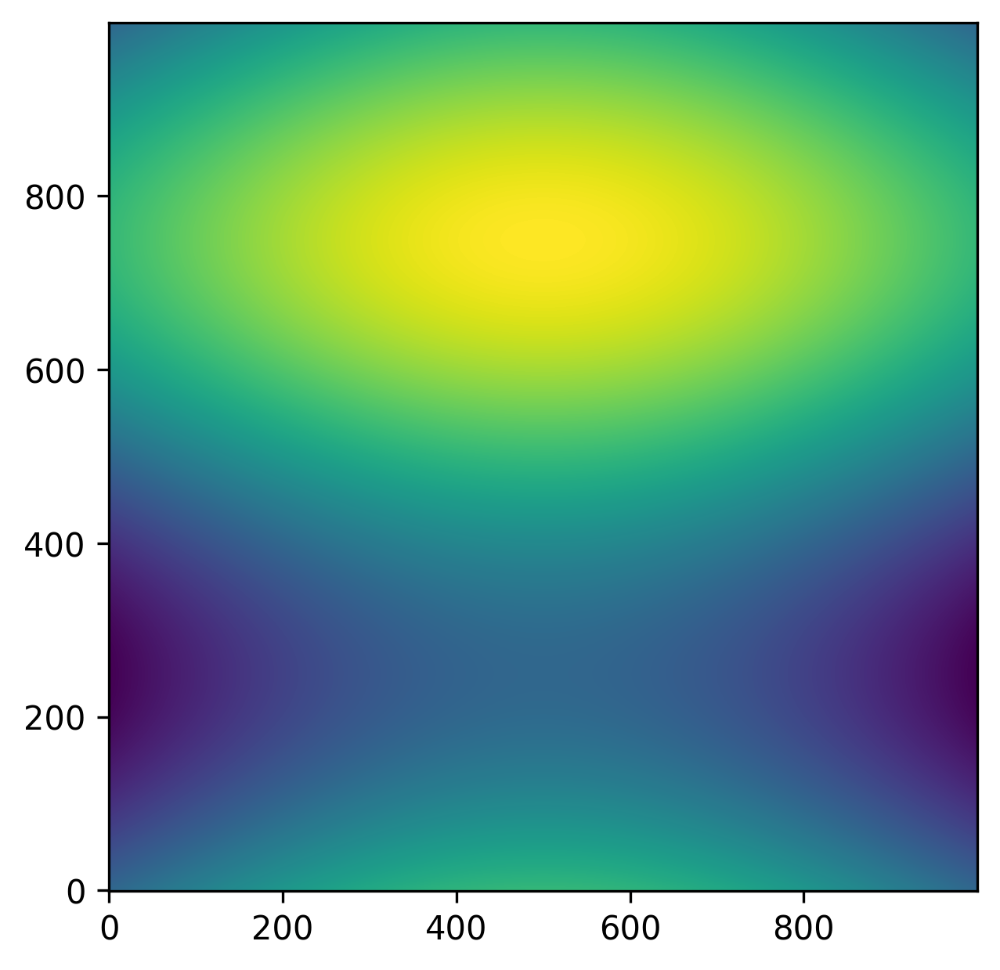
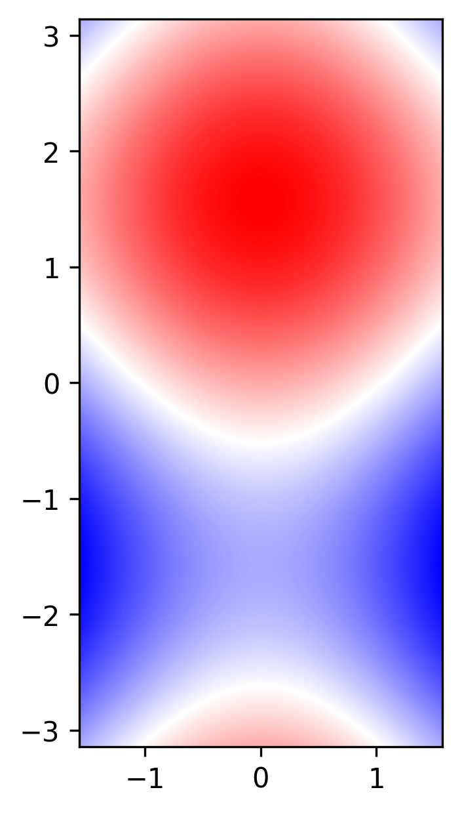

.. _matplotlib-summary_ax-imshow:

***********
ax.imshow()
***********

For the detailed documentation and examples see |matplotlib-imshow|_

Basic scatter
=============

``ax.imshow(z)`` is used to plot the function of two variables :math:`z(x,y)`
using the value of the function as a color.

.. code-block:: python

    import numpy as np
    import matplotlib.pyplot as plt

    fig, ax = plt.subplots()

    x = np.linspace(-np.pi/2, np.pi/2, 1000)
    y = np.linspace(-np.pi, np.pi, 1000)

    x,y = np.meshgrid(x,y)

    z = np.cos(x) + np.sin(y)

    ax.imshow(z)

Changing the origin
===================

.. code-block:: python

    import numpy as np
    import matplotlib.pyplot as plt

    fig, ax = plt.subplots()

    x = np.linspace(-np.pi/2, np.pi/2, 1000)
    y = np.linspace(-np.pi, np.pi, 1000)

    x,y = np.meshgrid(x,y)

    z = np.cos(x) + np.sin(y)

    ax.imshow(z, origin="lower")

Styling
=======

.. code-block:: python

  import numpy as np
  import matplotlib.pyplot as plt

  fig, ax = plt.subplots()

  x = np.linspace(-np.pi/2, np.pi/2, 1000)
  y = np.linspace(-np.pi, np.pi, 1000)

  x,y = np.meshgrid(x,y)

  z = np.cos(x) + np.sin(y)

  ax.imshow(z, origin="lower", cmap="bwr", extent=[-np.pi/2, np.pi/2, -np.pi, np.pi])

