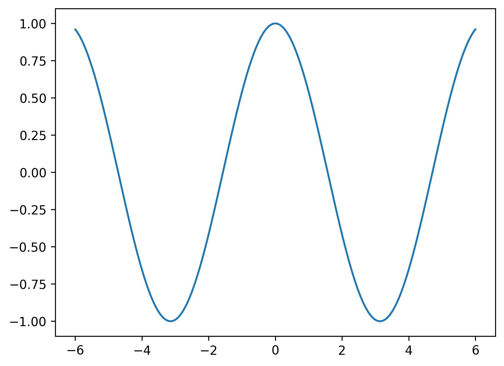
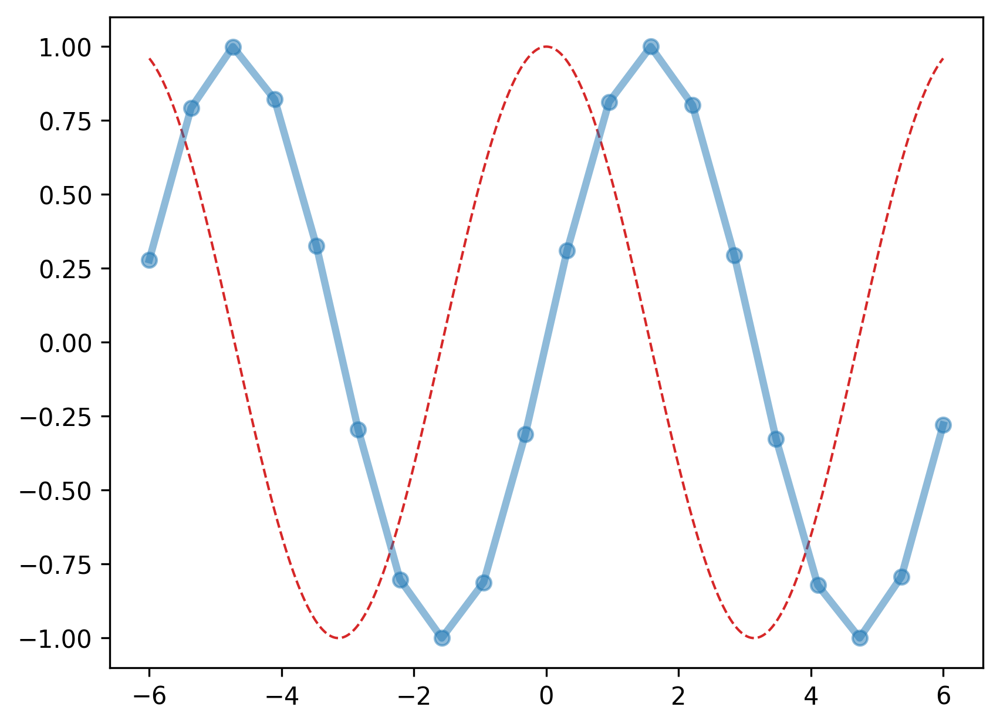

.. _matplotlib-summary_ax-plot:

*********
ax.plot()
*********

For the detailed documentation and examples see |matplotlib-plot|_

Basic plot
==========

``ax.plot(x, y)`` is used to plot line-styled plots of ``y`` over ``x``
The absolute minimum is to pass two coordinates to it:

.. code-block:: python

  import numpy as np
  import matplotlib.pyplot as plt

  fig, ax = plt.subplots()

  x = np.linspace(-6, 6, 1000)
  y = np.cos(x)

  ax.plot(x, y)

Changing linestyle
==================

.. code-block:: python

  import numpy as np
  import matplotlib.pyplot as plt

  fig, ax = plt.subplots()

  x1 = np.linspace(-6, 6, 1000)
  y1 = np.cos(x1)

  x2 = np.linspace(-6, 6, 20)
  y2 = np.sin(x2)

  ax.plot(x1, y1, "--", lw=1, color="tab:red")
  ax.plot(x2, y2, "o-", lw=3, alpha=0.5)

