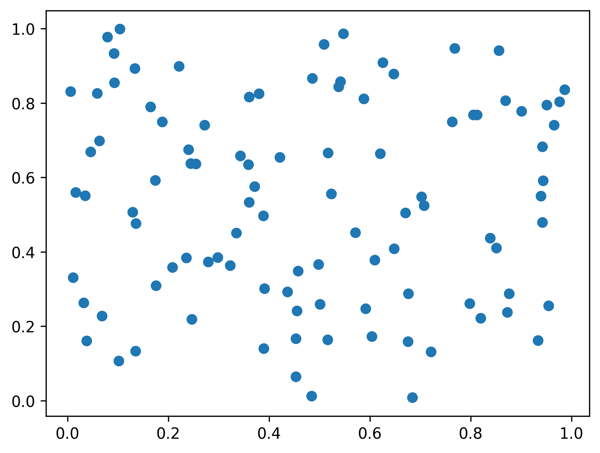
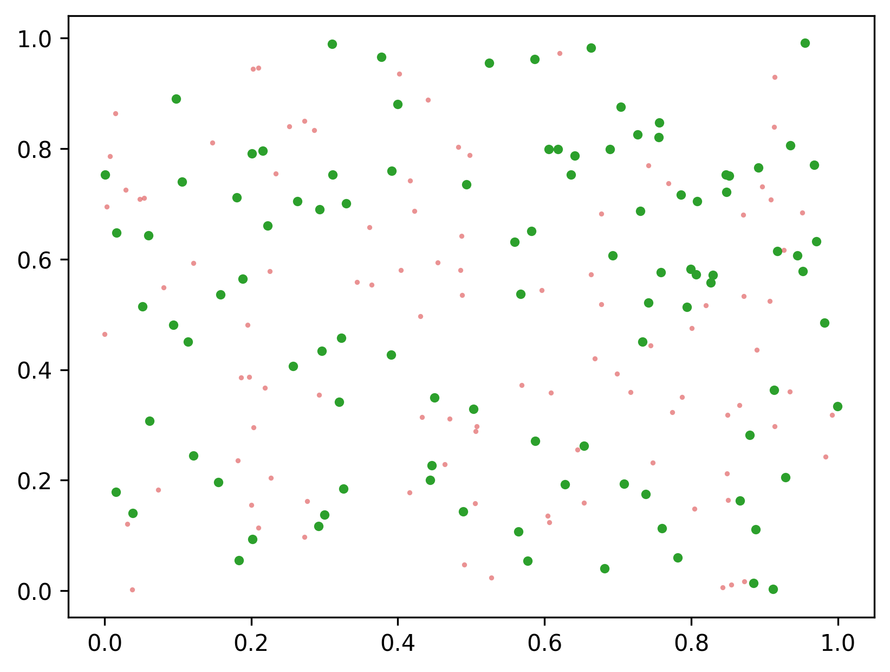
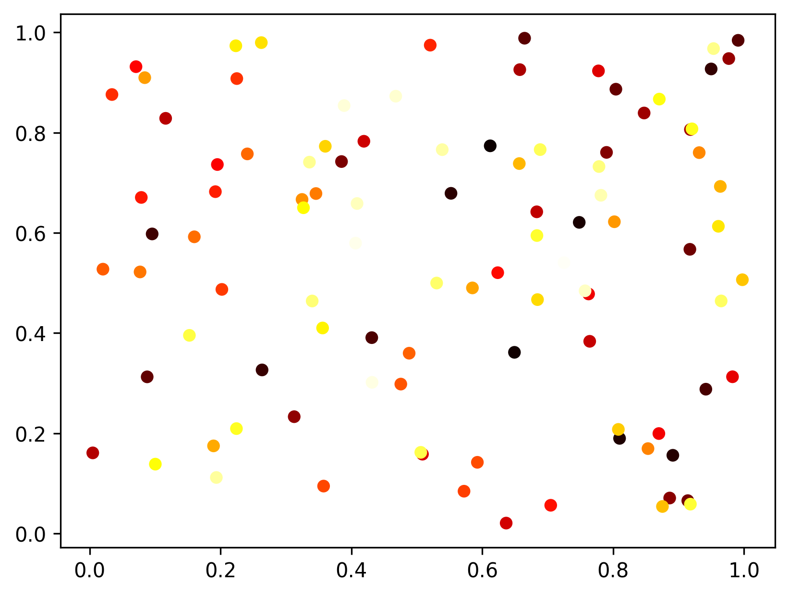

.. _matplotlib-summary_ax-scatter:

************
ax.scatter()
************

For the detailed documentation and examples see |matplotlib-scatter|_

Basic scatter
=============

``ax.scatter(x, y)`` is used to plot points with the coordinates ``y`` and ``x``
The absolute minimum is to pass two coordinates to it:

.. code-block:: python

  import numpy as np
  import matplotlib.pyplot as plt

  fig, ax = plt.subplots()

  x = np.random.random(100)
  y = np.random.random(100)

  ax.scatter(x, y)

Changing point style
====================

.. code-block:: python

  import numpy as np
  import matplotlib.pyplot as plt

  fig, ax = plt.subplots()

  x1 = np.random.random(100)
  x2 = np.random.random(100)
  y1 = np.random.random(100)
  y2 = np.random.random(100)

  ax.scatter(x1, y1, s=10, color="tab:green")
  ax.scatter(x2, y2, s=5, alpha=0.5, lw=0, color="tab:red")

Individual colors
=================

.. code-block:: python

  import numpy as np
  import matplotlib.pyplot as plt
  from matplotlib import colormaps
  from matplotlib.colors import Normalize

  norm = Normalize(vmin=0, vmax=100)
  cmap = colormaps["hot"]

  fig, ax = plt.subplots()

  x = np.random.random(100)
  y = np.random.random(100)

  colors = cmap(norm(np.linspace(0,99,100)))

  ax.scatter(x, y, s=40, c=colors, lw=0)

