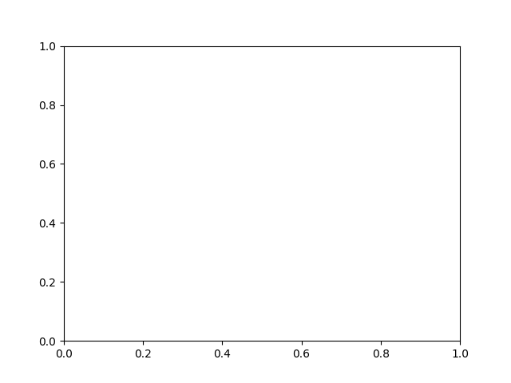
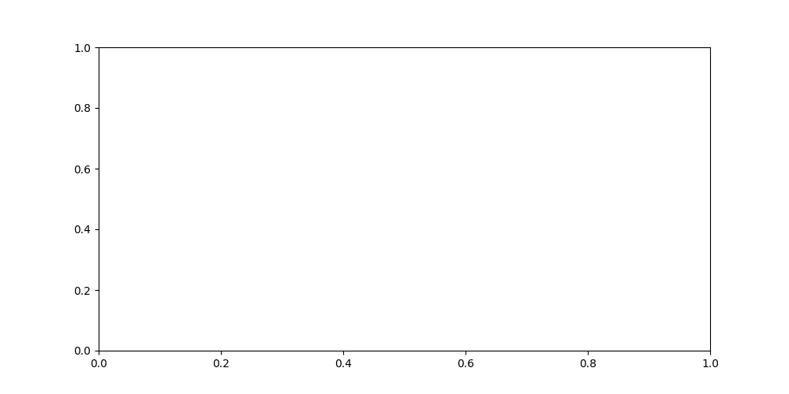
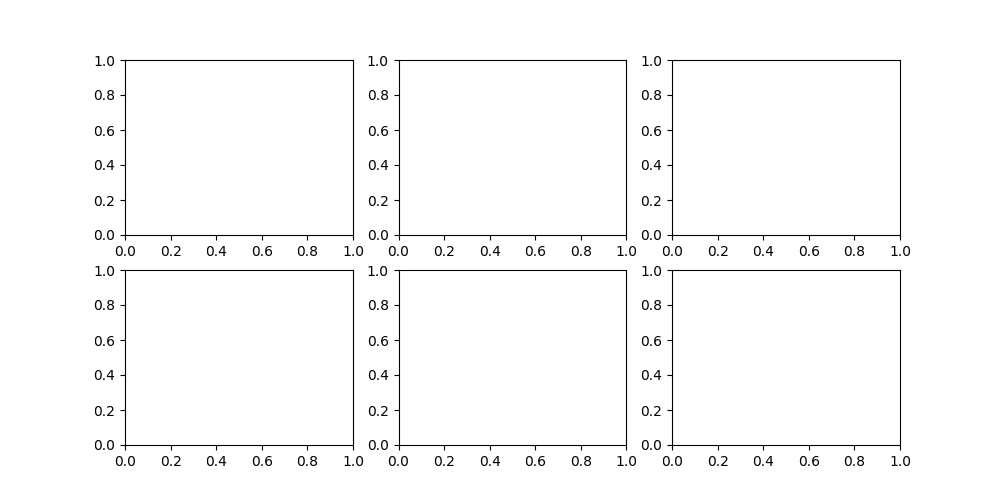

.. _matplotlib-summary:

**********
Matplotlib
**********

One of the most popular libraries for plotting with Python is matplotlib.

For the detailed and thorough introduction to the library we refer you to the
|matplotlib-user-guide|_ and |matplotlib-quickstart|_.

Basic logic
===========

In a nutshell every plot script can be simplified to the following scheme:

* Imports

* Data input and pre-processing

* Creation of ``fig`` and ``ax``.

* Plotting on ``ax``

* Decoration of ``ax``

* Saving the picture.

Data input and pre-processing is usually done with |NumPy|_, so we will not cover it
in this page.

Import
======

The standard way to import matplotlib is

.. code-block:: python

    import matplotlib.pyplot as plt

Then on the script the functions from the matplotlib module can be called as
``plt.functionname()``.

For some specific functionalities an additional import might be required. It will be
covered in the corresponding examples.

Creation of figure and axis
===========================

Figure and axis are objects, that form a base for you to operate on. Once created,
they are the entry points for majority of plotting and decoration functions.

The simplest way of creating them is an |matplotlib-subplots|_ function:

.. code-block:: python

  import matplotlib.pyplot as plt

  fig, ax = plt.subplots()

By default it creates one axis on a figure

You can vary the size of an axis (in inches), default is (6.4 by 4.8):

.. code-block:: python

  import matplotlib.pyplot as plt

  fig, ax = plt.subplots(figsize=(10, 5))

Or you can create several axes on a figure:

.. code-block:: python

  import matplotlib.pyplot as plt

  fig, axs = plt.subplots(2, 3, figsize=(10, 5))

  # Note: axs is an numpy array of axes:
  print(axs.shape)

For more layouts we direct you to the matplotlib documentation: |matplotlib-layout|_.

.. dropdown:: Complex custom layout

  We recommend a particular way to place the complex set of axis in a figure:

  .. code-block:: python

    import matplotlib.pyplot as plt

    # Choose a size of the figure in inches:
    fx = 11
    fy = 6

    # Create a figure
    fig = plt.figure(figsize=(fx, fy))

    # Target layout: 5 axis, one in the centre and four in the corners,
    # evenly spaced with custom offsets
    size_x = 3
    size_y = 2

    offset_left = 0.5
    offset_right = 0.3
    offset_bottom = 0.7
    offset_top = 0.1

    # Compute space between axis
    dx = (fx - 3 * size_x - offset_left - offset_right) / 2
    dy = fy - 2 * size_y - offset_bottom - offset_top

    # Add five axis. first argument is the (left, lower, width, height) in relative coordinates

    ax_left_top = fig.add_axes(
        (offset_left / fx, (offset_bottom + dy + size_y) / fy, size_x / fx, size_y / fy)
    )
    ax_left_bottom = fig.add_axes(
        (offset_left / fx, offset_bottom / fy, size_x / fx, size_y / fy)
    )
    ax_right_top = fig.add_axes(
        (
            (offset_left + 2 * size_x + 2 * dx) / fx,
            (offset_bottom + dy + size_y) / fy,
            size_x / fx,
            size_y / fy,
        )
    )
    ax_right_bottom = fig.add_axes(
        (
            (offset_left + 2 * size_x + 2 * dx) / fx,
            offset_bottom / fy,
            size_x / fx,
            size_y / fy,
        )
    )

    ax_center = fig.add_axes(
        (
            (offset_left + size_x + dx) / fx,
            (fy + offset_bottom - offset_top - size_y) / 2 / fy,
            size_x / fx,
            size_y / fy,
        )
    )

  .. image:: create-complex-layout.png

Plotting on ``ax``
==================

There are a number of plot types that are predefined in |matplotlib|_ library.

We cover some of them in the dedicated pages:

.. toctree::

  ax-plot/index
  ax-scatter/index
  ax-imshow/index

Once the plotting is done we can turn to the decoration of the plot.

Decoration of ``ax``
====================

Labels
------

Legend
------

Ticks
-----

Colorbar
--------

Title
-----

Text
----

Saving the picture
==================

At the end of the script the picture should be saved:

.. code-block:: python

  # Extention can be change (i.e. .pdf, .tiff, ...)
  plt.savefig("filename.png", dpi=300, bbox_inches="tight")
  # Do not forget to close the figure.
  # It is important if one script plots hundreds of them in a cycle
  plt.close()

    
